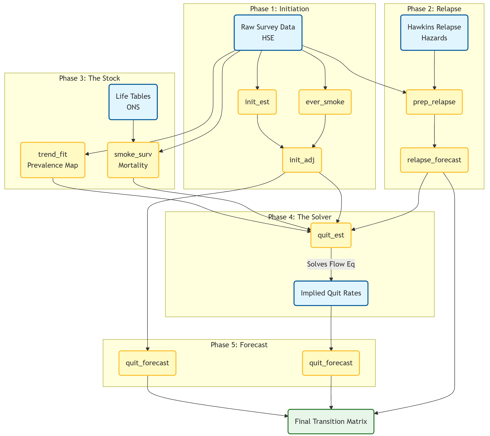
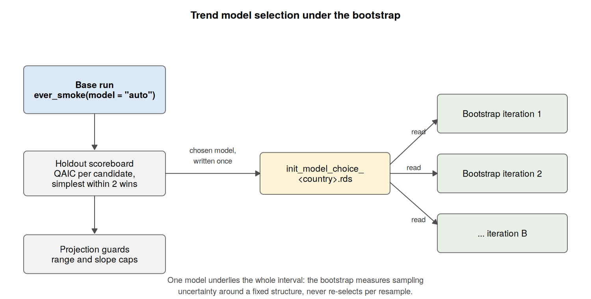
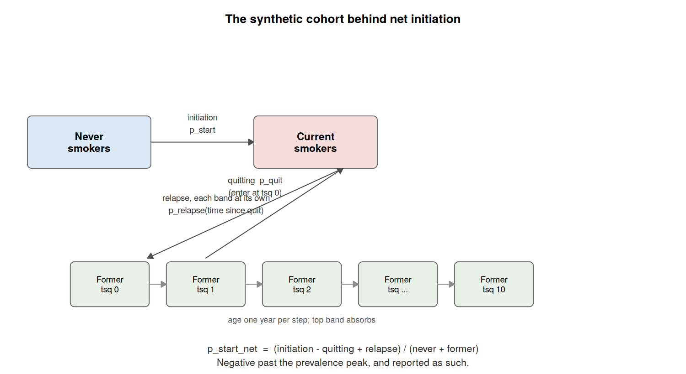

# Workflow for Estimating Smoking Transition Probabilities

## Overview

This vignette provides a step-by-step guide to estimating the annual
probabilities of smoking initiation, quitting, and relapse using the
`smktrans` package. These estimates underpin the Sheffield Tobacco
Policy Model (STPM).

The core philosophy of this workflow is **consistency**. We do not
estimate rates in isolation; instead, we use a “Stock and Flow” approach
where the robustly measured number of smokers (the Stock) is used to
solve for the unobservable quit rates (the Flow).

The package now carries validation code that compares the estimates
against survey data that had no part in producing them. The results of
the validation for England are written up in the companion vignette,
*Validation of the England transition probabilities*.

### The Workflow at a Glance

The following diagram illustrates how raw survey data is transformed
into a consistent transition matrix.



## Phase 1: Initiation (The Inflow)

**Objective:** Estimate the probability of a Never Smoker becoming a
Smoker at age $`x`$ in year $`t`$.

**The Challenge:** People often forget exactly when they started smoking
(“Recall Bias”). Furthermore, differential mortality means that early
initiators are less likely to survive to be surveyed in older age. Using
raw recall data alone would suggest initiation rates were lower in the
past than they actually were.

**The Solution:** The [Holford
Method](https://doi.org/10.1016/j.amepre.2013.10.022). We reconstruct
histories based on reported starting ages (subject to bias) and adjust
them to match the robust “Ever-Smoker” prevalence directly observed in
each year.

1.  **Reconstruct (`init_est`):** Builds the “Risk Set” for every cohort
    using cross-sectional recall. Never smokers carry no starting age,
    so what this estimates is the *distribution of starting ages among
    people who ever start*; the level of the curve is pinned down
    entirely by the calibration in step 3.  
2.  **Target (`ever_smoke`):** Fits a Generalized Linear Model
    (Quasibinomial) to estimate the true proportion of Ever-Smokers at
    age 30. The model structure can now be selected from the data with
    `model = "auto"`: candidates are scored on their ability to predict
    held-out survey years, the simplest model within a small margin of
    the best wins, and the winner’s projection is checked against guard
    rails before it is accepted. The scoreboard travels with the output
    so the choice is auditable.  
3.  **Calibrate (`init_adj`):** Scales the raw curves so their
    cumulative sum matches the targets. Cohorts too young to have been
    observed at the reference age are first *completed*: their curve is
    multiplied by the ratio $`F(30)/F(r)`$ measured on the most recent
    fully observed cohorts, so the age-30 target is compared against an
    age-30 quantity rather than an age-$`r`$ one. This lets the youngest
    cohorts with usable data calibrate on their own numbers
    (`min_ref = 18`) instead of inheriting a borrowed profile.

``` r

# 1. Reconstruct longitudinal histories from cross-sectional recall
init_raw <- init_est(
  data = survey_data,
  strat_vars = c("sex", "imd_quintile")
)

# 2. Estimate the 'Truth': Proportion of ever-smokers at age 25-34
# "auto" scores the candidate structures on held-out years and picks the
# simplest one that predicts well; an explicit "model8" etc. still works
target_trends <- ever_smoke(
  data = survey_data,
  model = "auto",
  age_cats = c("25-34")
)

# 3. Adjust the curves using the Holford method
# This corrects the recall bias to match the 'truth' at age 30, completing
# truncated cohorts up to an age-30 equivalent before the comparison
init_final <- init_adj(
  init_data = init_raw,
  ever_smoke_data = target_trends$predicted_values,
  ref_age = 30,
  min_ref = 18
)
```

### Model selection and the bootstrap

Selection is a base-run job. The base estimation chooses the
`ever_smoke` structure, writes the choice next to the other outputs, and
every bootstrap iteration reads it back rather than re-selecting. One
model therefore underlies the whole uncertainty interval; the bootstrap
measures sampling variation around a fixed structure, never a blend of
structures.



## Phase 2: Relapse (The Reflow)

**Objective:** Estimate the probability of a Former Smoker becoming a
Current Smoker.

**The Challenge:** Relapse risk depends heavily on **Time Since Quit
(TSQ)**. Most relapse happens in year 1. However, general
cross-sectional surveys rarely capture enough long-term quitters to
estimate late-stage relapse (5+ years post-quit) reliably.

**The Solution:** We combine survey demographics with clinical evidence
([Hawkins et al., 2010](https://doi.org/10.1093/ntr/ntq175)) which
provides the *shape* of the relapse hazard curve.

The packaged `hawkins_relapse` table is built by
`data-raw/Relapse_Hawkins2010/prep_Hawkins_relapse.R`. The build pools
the paper’s sparse years 6–9 into a single monotone tail, and calibrates
the baseline odds so that a cohort reconstructed from the paper’s own
Table 1 reproduces its reported one-year relapse rate exactly. The
script verifies this on every run.

1.  **Map (`prep_relapse`):** Calculates the weighted average relapse
    probability for every Age/Sex/IMD group by mapping their specific
    characteristics to the Hawkins hazard ratios.  
2.  **Hold (`relapse_forecast`):** Carries the surface forward
    *unchanged*. Hawkins is a single study with no time dimension, so
    the only year-to-year movement in the relapse surface comes from the
    survey’s demographic re-weighting; fitting a trend to that and
    projecting it produced relapse probabilities outside anything the
    evidence contains, which the validation suite’s envelope check
    caught. The forecast is therefore stationary: it claims nothing the
    data does not.

``` r

# 1. Map survey demographics to Hawkins' clinical hazard ratios
relapse_data <- prep_relapse(
  data = survey_data,
  hawkins_relapse = smktrans::hawkins_relapse
)

# 2. Carry the surface forward unchanged (forecast_type = "stationary"
# inside estimate_relapse): the evidence has no time dimension to project
relapse_final <- relapse_forecast(
  relapse_forecast_data = relapse_trend_forecast, 
  relapse_by_age_imd_timesincequit = relapse_data$relapse_by_age_imd_timesincequit
)
```

## Phase 3: Trends in Current, Former and Never Smoking (The Stock)

Before we can solve for quitting, we need a clear picture of the “Stock”
(Prevalence) and the “Leak” (Mortality).

### Step 3.1: The Prevalence Map (`trend_fit`)

Raw survey prevalence is noisy. We cannot calculate year-on-year flows
from jagged data. We fit a **Multinomial Response Surface** to smooth
the data over time and age.

The model assumes the log-odds of being in a specific state are a
function of high-order interactions:  
``` math
\ln\left(\frac{P_{state}}{P_{ref}}\right) = f(\text{Age}^4, \text{Year}^3, \text{Sex}, \text{IMD})
```

This surface has been tested against held-out survey years (fit on all
years but the last, predict the last, score against the people actually
surveyed in it) and beats a carry-last-year-forward baseline
comfortably. Any proposed change to it faces the same test: the harness
lives at `transition_probability_validation/30_trend_holdout.R`.

### Step 3.2: Differential Mortality (`smoke_surv`)

Smokers die faster than non-smokers. If we ignore this, we might mistake
a drop in smoker numbers (due to death) for quitting. We calculate
survival probabilities ($`p_x`$) specifically for Current, Former, and
Never smokers using disease-specific relative risks.

``` r

# 1. Fit a smooth surface to the smoking states (Multinomial Model)
trend_surface <- trend_fit(
  data = survey_data,
  max_iterations = 1000,
  smoker_state_var = "smk.state"
)

# 2. Calculate survival probabilities by smoking status
mortality_diffs <- smoke_surv(
  data = survey_data,
  mx_data = tob_mort_data,
  diseases = tobalcepi::tob_disease_names
)
```

## Phase 4: Quitting (The Solver)

**Objective:** Calculate the “Hidden Flow” (Quitting).

**The Logic:**  
We rely on the demographic balancing equation. We possess the following
knowns:  
1. **Stock ($`N_t, N_{t+1}`$):** From `trend_fit`.  
2. **Inflow (Start):** From `init_adj`.  
3. **Reflow (Relapse):** From `prep_relapse`.  
4. **Death (Survival $`S`$):** From `smoke_surv`.

We plug these into the **Flow Equation** to solve for the unknown Quit
probability ($`q`$). The fundamental population balance is:

``` math
N_{t+1} = \left[ N_t \times S \times (1 - q) \right] + \text{Inflow}
```

Rearranging this to solve for $`q`$:

``` math
q = 1 - \frac{N_{t+1}}{N_t \times S} + \frac{\text{Inflow}}{N_t \times S}
```
  
*Where Inflow includes both Relapse and Initiation.*

This ensures internal consistency: the calculated quit rates perfectly
reproduce the observed prevalence trends when run forward.

``` r

# Solve for the unknown variable: Quitting
# This function balances the stocks and flows
quit_rates <- quit_est(
  trend_data = trend_surface,
  survivorship_data = survivorship_data,
  mortality_data = mortality_diffs$data_for_quit_ests,
  relapse_data = relapse_data$relapse_by_age_imd,
  initiation_data = init_final
)
```

## Phase 5: Forecasting the Future

**Objective:** Project these rates to 2040 and beyond.

**The Solution:** The **Lee-Carter SVD Method** (see the R package
[Demography](https://doi.org/10.32614/CRAN.package.demography)).  
We employ a Singular Value Decomposition (SVD) approach, commonly used
in mortality forecasting. This allows us to model the logit of the rates
as a linear combination of an age-specific profile and a time-varying
index.

``` math
\text{logit}(P_{x,t}) = \alpha_x + \beta_x \kappa_t + \epsilon_{x,t}
```

Where:  
\* **$`\alpha_x`$:** The average age profile (e.g., quitting peaks at
age 30 and 60).  
\* **$`\kappa_t`$:** The time trend index (e.g., the general decline or
rise in rates over years).  
\* **$`\beta_x`$:** The sensitivity of each age group to the time trend.

We project the *Trend* ($`\kappa_t`$) forward linearly and recombine it
with the *Shape* ($`\alpha_x, \beta_x`$).

Two things are worth knowing about this function. First, everything it
returns – past years as well as future – is the *reconstruction* from
the decomposition, not the input estimates: the published historical
surface is the smoothed rank-1 fit. Second, for initiation it runs with
`preserve_zeros = TRUE`: since the cumulative-curve fix in `p_dense`, a
zero in the initiation surface means nobody in that cohort starts at
that age, and those cells are held out of the surface smoothing rather
than clamped and averaged with their neighbours – which previously
inflated the published initiation tail at ages 24–25 by a factor of 3 to
4. Quitting and relapse leave the flag off; their zeros are sparse-cell
noise and smoothing over them is the right treatment.

``` r

# Forecast Quitting
quit_future <- quit_forecast(
  data = quit_rates,
  forecast_var = "p_quit",
  forecast_type = "continuing",
  time_horizon = 2040
)

# Forecast Initiation (using the same function)
# Zeros in the surface are real zeros and are kept out of the smoothing;
# the trend jumps off from the last estimated year rather than the year before
init_future <- quit_forecast(
  data = init_final,
  forecast_var = "p_start",
  forecast_type = "continuing",
  time_horizon = 2040,
  preserve_zeros = TRUE
)
```

## Phase 6: Checking the Answer

**Objective:** Establish that the estimates agree with data that had no
part in producing them.

Two instruments do this work.

**Net initiation (`calculate_net_initiation`):** a synthetic cohort is
walked through the estimated probabilities, tracking never smokers,
current smokers, and former smokers *by time since quit* – quitters
enter at zero years and age one band per year, so every former smoker
relapses at the rate that actually applies to them. The net flow into
smoking, $`(\text{initiation} - \text{quitting} + \text{relapse})`$
relative to the non-smoking population, is a quantity an independent
prevalence survey can also measure. It turns negative past the age where
the cohort’s smoking prevalence peaks, and is reported as such rather
than clamped at zero: the location of that sign change is itself part of
what gets compared.



**The validation suite** (`transition_probability_validation/` in the
project repository) compares quitting and net initiation against the
Smoking Toolkit Study over the estimated years, verifies the relapse
surface against an envelope derived from its own Hawkins inputs, and
knits the results into a standing report. The report doubles as a
regression test: it is re-run after any change to the estimation, and
the England results are written up in the companion vignette.
