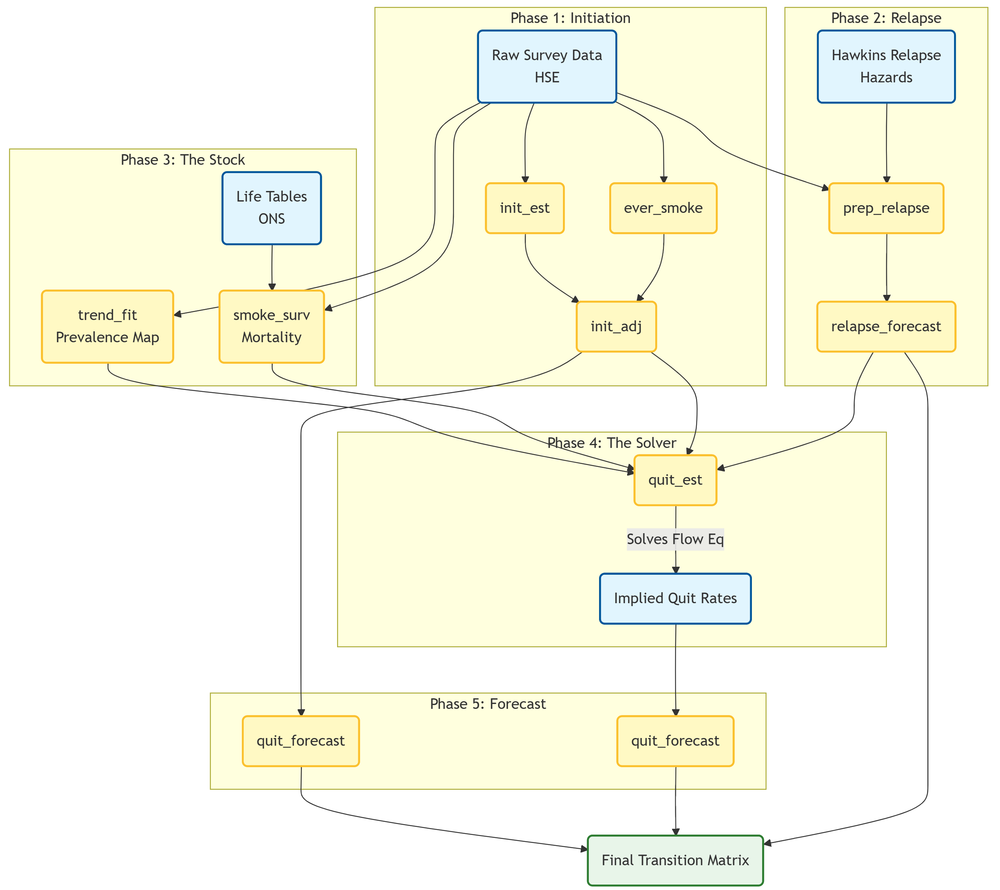

```{r setup, include=FALSE}

knitr::opts_chunk$set(
  collapse = TRUE,
  comment = "#>"
)
```  

## Overview

This vignette provides a step-by-step guide to estimating the annual probabilities of smoking initiation, quitting, and relapse using the `smktrans` package. These estimates underpin the Sheffield Tobacco Policy Model (STPM).   

The core philosophy of this workflow is **consistency**. We do not estimate rates in isolation; instead, we use a "Stock and Flow" approach where the robustly measured number of smokers (the Stock) is used to solve for the unobservable quit rates (the Flow).   

### The Workflow at a Glance

The following diagram illustrates how raw survey data is transformed into a consistent transition matrix.   

```{r flow_diagram, echo=FALSE, out.width="100%", fig.align='center'}

```

## Phase 1: Initiation (The Inflow)

**Objective:** Estimate the probability of a Never Smoker becoming a Smoker at age $x$ in year $t$.   

**The Challenge:** Older people often forget exactly when they started smoking ("Recall Bias"). Furthermore, differential mortality means that early initiators are less likely to survive to be surveyed in older age. Using raw recall data alone would suggest initiation rates were lower in the past than they actually were.   

**The Solution:** The **Holford Method**. We reconstruct histories based on reported starting ages (subject to bias) and adjust them to match the robust "Ever-Smoker" prevalence directly observed in each year.   

1.  **Reconstruct (`init_est`):** Builds the "Risk Set" for every cohort using cross-sectional recall.   
2.  **Target (`ever_smoke`):** Fits a Generalized Linear Model (Quasibinomial) to estimate the true proportion of Ever-Smokers at age 30.   
3.  **Calibrate (`init_adj`):** Scales the raw curves so their cumulative sum matches the targets.   

```{r initest, eval = F}
# 1. Reconstruct longitudinal histories from cross-sectional recall
init_raw <- init_est(
  data = survey_data,
  strat_vars = c("sex", "imd_quintile")
)

# 2. Estimate the 'Truth': Proportion of ever-smokers at age 25-34
# We use Model 8 (Sex + IMD + Year_Bin) for a stable target
target_trends <- ever_smoke(
  data = survey_data,
  model = "model8", 
  age_cats = c("25-34")
)

# 3. Adjust the curves using the Holford method
# This corrects the recall bias to match the 'truth' at age 30
init_final <- init_adj(
  init_data = init_raw,
  ever_smoke_data = target_trends$predicted_values,
  ref_age = 30
)
```   

## Phase 2: Relapse (The Reflow)

**Objective:** Estimate the probability of a Former Smoker becoming a Current Smoker.   

**The Challenge:** Relapse risk depends heavily on **Time Since Quit (TSQ)**. Most relapse happens in year 1. However, general cross-sectional surveys rarely capture enough long-term quitters to estimate late-stage relapse (5+ years post-quit) reliably.   

**The Solution:** We combine survey demographics with clinical evidence (Hawkins et al., 2010) which provides the *shape* of the relapse hazard curve.   

1.  **Map (`prep_relapse`):** Calculates the weighted average relapse probability for every Age/Sex/IMD group by mapping their specific characteristics to the Hawkins hazard ratios.   
2.  **Forecast (`relapse_forecast`):** Projects the general trend forward and applies it as a scalar to the detailed TSQ curves.   

```{r relapse, eval = F}
# 1. Map survey demographics to Hawkins' clinical hazard ratios
relapse_data <- prep_relapse(
  data = survey_data,
  hawkins_relapse = smktrans::hawkins_relapse
)

# 2. Forecast the trend and apply it to the detailed Time-Since-Quit data
# Note: relapse_trend_forecast is derived from a preliminary run of quit_forecast
relapse_final <- relapse_forecast(
  relapse_forecast_data = relapse_trend_forecast, 
  relapse_by_age_imd_timesincequit = relapse_data$relapse_by_age_imd_timesincequit
)
```   

## Phase 3: Trends in Current, Former and Never Smoking (The Stock)

Before we can solve for quitting, we need a clear picture of the "Stock" (Prevalence) and the "Leak" (Mortality).   

### Step 3.1: The Prevalence Map (`trend_fit`)
Raw survey prevalence is noisy. We cannot calculate year-on-year flows from jagged data. We fit a **Multinomial Response Surface** to smooth the data over time and age.   

The model assumes the log-odds of being in a specific state are a function of high-order interactions:   
$$\ln\left(\frac{P_{state}}{P_{ref}}\right) = f(\text{Age}^4, \text{Year}^3, \text{Sex}, \text{IMD})$$

### Step 3.2: Differential Mortality (`smoke_surv`)
Smokers die faster than non-smokers. If we ignore this, we might mistake a drop in smoker numbers (due to death) for quitting. We calculate survival probabilities ($p_x$) specifically for Current, Former, and Never smokers using disease-specific relative risks.   

```{r esttrend, eval = F}
# 1. Fit a smooth surface to the smoking states (Multinomial Model)
trend_surface <- trend_fit(
  data = survey_data,
  max_iterations = 1000,
  smoker_state_var = "smk.state"
)

# 2. Calculate survival probabilities by smoking status
mortality_diffs <- smoke_surv(
  data = survey_data,
  mx_data = tob_mort_data,
  diseases = tobalcepi::tob_disease_names
)
```   

## Phase 4: Quitting (The Solver)

**Objective:** Calculate the "Hidden Flow" (Quitting).   

**The Logic:**   
We rely on the demographic balancing equation. We possess the following knowns:   
1.  **Stock ($N_t, N_{t+1}$):** From `trend_fit`.  
2.  **Inflow (Start):** From `init_adj`.  
3.  **Reflow (Relapse):** From `prep_relapse`.  
4.  **Death (Survival $S$):** From `smoke_surv`.  

We plug these into the **Flow Equation** to solve for the unknown Quit probability ($q$). The fundamental population balance is:  

$$N_{t+1} = \left[ N_t \times S \times (1 - q) \right] + \text{Inflow}$$  

Rearranging this to solve for $q$:  

$$q = 1 - \frac{N_{t+1}}{N_t \times S} + \frac{\text{Inflow}}{N_t \times S}$$  
*Where Inflow includes both Relapse and Initiation.*  

This ensures internal consistency: the calculated quit rates perfectly reproduce the observed prevalence trends when run forward.   

```{r quitsolve, eval = F}
# Solve for the unknown variable: Quitting
# This function balances the stocks and flows
quit_rates <- quit_est(
  trend_data = trend_surface,
  survivorship_data = survivorship_data,
  mortality_data = mortality_diffs$data_for_quit_ests,
  relapse_data = relapse_data$relapse_by_age_imd,
  initiation_data = init_final
)
```   

## Phase 5: Forecasting the Future

**Objective:** Project these rates to 2040 and beyond.   

**The Solution:** The **Lee-Carter SVD Method**.   
We employ a Singular Value Decomposition (SVD) approach, commonly used in mortality forecasting. This allows us to model the logit of the rates as a linear combination of an age-specific profile and a time-varying index.   

$$\text{logit}(P_{x,t}) = \alpha_x + \beta_x \kappa_t + \epsilon_{x,t}$$  
 
Where:   
* **$\alpha_x$:** The average age profile (e.g., quitting peaks at age 30 and 60).   
* **$\kappa_t$:** The time trend index (e.g., the general decline or rise in rates over years).   
* **$\beta_x$:** The sensitivity of each age group to the time trend.  

We project the *Trend* ($\kappa_t$) forward linearly and recombine it with the *Shape* ($\alpha_x, \beta_x$).   

```{r forecast, eval = F}
# Forecast Quitting
quit_future <- quit_forecast(
  data = quit_rates,
  forecast_var = "p_quit",
  forecast_type = "continuing",
  time_horizon = 2040
)

# Forecast Initiation (using the same function)
init_future <- quit_forecast(
  data = init_final,
  forecast_var = "p_start",
  forecast_type = "continuing",
  time_horizon = 2040
)
```


